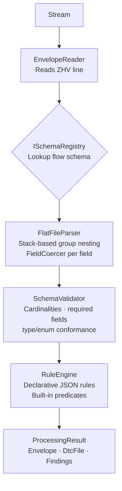

# Correla.IndustryFlows

Generic, schema-driven parser and validator for files exchanged under the [Elexon Data Transfer Catalogue (DTC)](https://www.elexon.co.uk/operations-settlement/bsc-central-services/balancing-mechanism-reporting-agent/dtc/) — currently targeting version **15.4**.

---

## Quick Start

```bash
# Clone
git clone https://github.com/correla/Correla.IndustryFlows.git
cd Correla.IndustryFlows

# Restore & build
dotnet restore
dotnet build

# Run tests
dotnet test

# Run API (development)
dotnet run --project Correla.IndustryFlows.Api
```

---

## Architecture

The runtime processes a DTC flat file in three phases, orchestrated by `DtcProcessor`:



### Phase 1 — Envelope detection
Reads only the `ZHV` (file header) line. Returns an `Envelope` containing the flow ID, version, sender, and recipient. This determines which schema to load before reading the body.

### Phase 2 — Schema-driven parsing
Resolves `FlowSchema` from `ISchemaRegistry` (backed by the JSON bundle under `docs/elec/15.4/schemas/`). Walks the file line-by-line using the schema as a grammar. Each line's group code drives a stack-based nesting algorithm; fields are bound positionally and coerced to their DTC domain types.

### Phase 3 — Validation
Two layers:
- **Structural** — cardinalities, required fields, type and enum conformance. Driven by schema alone.
- **Rule pack** — cross-field and contextual rules described as declarative JSON. Named built-in predicates handle MPAN check digits, HH midnight encoding, uniqueness checks, etc.

### Schema bundle
The bundle at `docs/elec/15.4/schemas/` is produced by the `dtc-schema-extractor` Python skill from the four official Elexon source documents. It contains:

| File | Contents |
|------|----------|
| `manifest.json` | 206 flow entries mapping `(flowId, version)` → file path |
| `domains.json` | 19 DTC type domains |
| `data-items.json` | 1,672 J-item definitions with valid sets |
| `cross-reference.json` | 1,076 From→To→Flow routing rules |
| `flows/D{NNNN}_v{NNN}.json` | One schema per flow version |

To consume the library from a host application:

```csharp
// In Program.cs or equivalent
services.AddDtcParser(opts =>
{
    opts.BundlePath = "path/to/schemas/";
    opts.RegisterDefaultPredicates = true;
});

// Inject DtcProcessor and call ProcessAsync
var result = await processor.ProcessAsync(fileStream);
if (!result.Success)
    logger.LogError("Fatal: {Reason}", result.FailureReason);

foreach (var finding in result.Findings.Where(f => f.Severity == Severity.Error))
    logger.LogWarning("[{RuleId}] {Path}: {Message}", finding.RuleId, finding.Path, finding.Message);
```

---

## API Endpoints

| Method | Path | Description |
|--------|------|-------------|
| `POST` | `/flows/parse` | Upload a DTC flat file as `multipart/form-data` (field `file`). Returns `ProcessingResult` JSON (200 on success, 400 on fatal failure). |
| `POST` | `/flows/generate` | POST a `GenerateRequest` JSON body containing the `DtcFile` tree. Returns the DTC flat file as `text/plain` (200), or `400` if the flow is unknown, or `422` with findings if validation fails. |

**Example — parse:**
```bash
curl -F "file=@path/to/D0010.dtc" http://localhost:5000/flows/parse
```

**Example — generate:**
```bash
curl -X POST http://localhost:5000/flows/generate \
  -H "Content-Type: application/json" \
  -d '{ "flowId":"D0010","flowVersion":"002","sender":"NHHDA","recipient":"UDMS","fileReference":"FILE-001","file":{ ... } }'
```

---

## Repo Map

```
Correla.IndustryFlows/
├── docs/
│   └── elec/
│       └── 15.4/
│           ├── *.docx              ← Elexon source documents (Domains, Data Items, Flows, Cross Ref)
│           └── schemas/            ← Generated JSON schema bundle (206 flows)
├── src/
│   ├── Correla.IndustryFlows.Dtc/  ← Core DTC parser/validator library (net10.0)
│   └── Correla.IndustryFlows.Shared/ ← Types shared across projects (net10.0, no upward deps)
├── Correla.IndustryFlows.Api/      ← ASP.NET Core minimal-API host (net10.0)
│   │                                  POST /flows/parse  — flat file → JSON
│   │                                  POST /flows/generate — JSON → flat file
├── tests/
│   ├── Correla.IndustryFlows.Dtc.Tests/ ← xUnit tests for the Dtc library (102 tests)
│   └── Correla.IndustryFlows.Api.Tests/ ← Integration tests for the API endpoints (12 tests)
├── AGENTS.md                       ← AI coding agent operating instructions
├── spec.md                         ← DTC Parser & Validator implementation specification
└── Correla.IndustryFlows.sln
```

